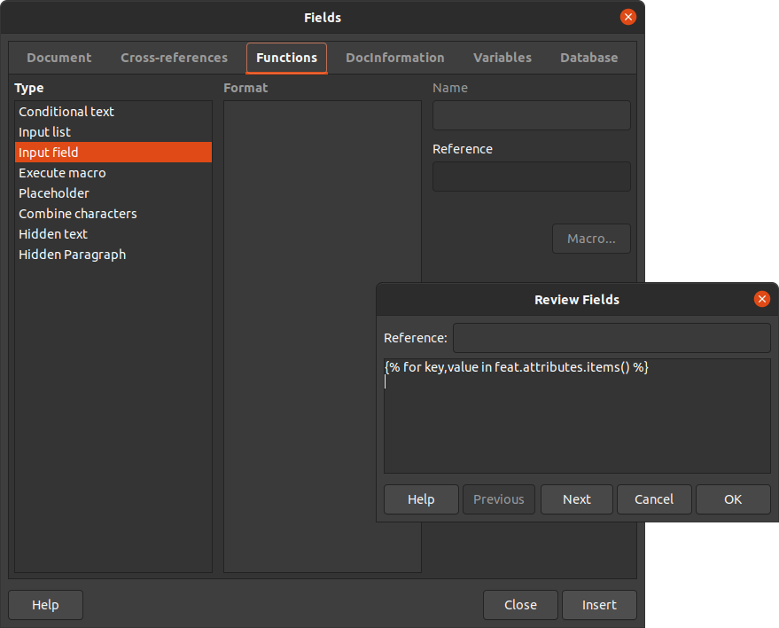
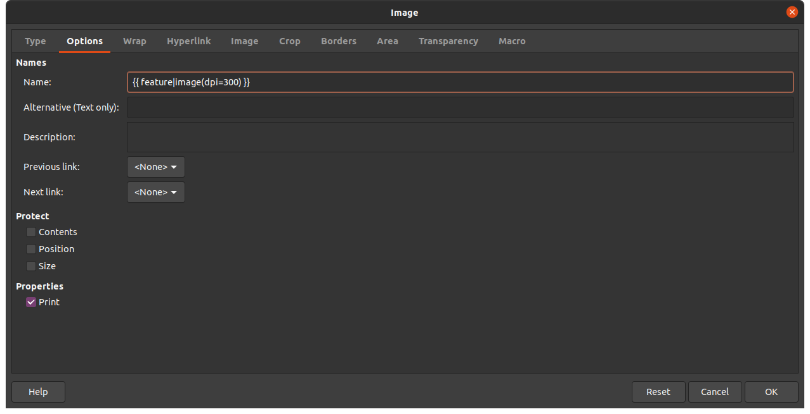

# QGIS report wizard

[](https://github.com/enricofer/qgis_report_wizard/actions/workflows/docker-image.yml)

The plugin makes use of python templating libraries for creating reports from data within current QGIS project in the following formats:

- ODT
- Text (html, xml, markdown, json etc...)

A set of sample templates and test data can be found in the [test/templates directory](https://github.com/enricofer/qgis_report_wizard/tree/master/test/templates)

## python dependencies

- [jinja2](https://jinja.palletsprojects.com/en/3.0.x/)  usually bundled with QGIS distribution or `pip install jinja2` if not provided
- [secretary](https://github.com/christopher-ramirez/secretary)  bundled with the plugin as external library

## jinja2 template syntax

The template engine parses text document and injects contents from a provided data environment following instructions contained in  of template tags: 

- double curly braces for variables: `{{ variable }}`
- curly brace and percent for statements: ``
- curly brace and hash for comments `{# comment #}`

#### variables

Structured variables can be accessed with a dot syntax like objects: `{{ variable.key.subkey }}` but can be accessed with the usual python dictionary syntax:  `{{ variable["key"]["subkey"] }}`

#### filters

Variables can be modified by filters. `{{ variable|filter(arguments) }}` The filter is basically a function that accept a variable as input and modify its contents following the provided arguments

There are standard filters, provided by base Jinjia2 installation, and custom templates, added by jinjia2 based applications

#### statements

The statements tags define blocks of text that can be conditionally rendered or iterated or asssume a certain meaning for the template engine, for example for escaping/encoding or defining functional blocks. The main statement tags are

**the conditional tag:**

```jinja2
 
block of text to be rendered if condition1 is true
 
block of text to be rendered if condition2 is true

block of text to be rendered if condition1 and condition2 are false

```

within `if/endif` tags `elif` and `else` tags are optional 

**the for cycle tag:**

```jinja2

block of text to be repeated for each item: {{ item }} in list

```

the cycle statement typically iterate over a list variable but can be used to iterate over a dictionary  object:

```jinja2

block of text to be repeated for each dictionary item {{ value }}
accessible by {{ key }} key

```

Complex, data driven, documents can be generated mixing and nesting conditional and cycle statements with context variables and static text. Templating is typically is used in dynamyc html page generation in python web application (django, flask, etc) but can be used in QGIS desktop environment to generate "project" driven complex documents and reports, enriched with data related geographic frames generated by the powerful QGIS rendering engine.

## the plugin template environment

The plugin provides to the template engine a jinja2 data environment containing most relevant tabular and geographic informations about current project like variables, bookmarks, themes, print layouts, layers and vector features whenever specified. Those informations are stored in four variables that can be used in template:

- **globals**: information about project and current visualization on map canvas

- **layers**: information about loaded layers

- **features**: attributes and geometries about a specified vector layer

- **layouts**: information about defined print layouts

  

## the global variable

A dictionary variable containing general informations

| key           | meaning                                                      | tag syntax                                                   |
| ------------- | ------------------------------------------------------------ | ------------------------------------------------------------ |
| project       | the project object instance. <br />Further information can be retrieved <br />calling [QgsProject API methods](https://qgis.org/pyqgis/master/core/QgsProject.html) | `{{ globals.project }}`<br />`{{ globals.project.crs() }}`<br />`{{ globals.project.title() }}`<br /> |
| mapCanvas     | the current map canvas object instance. <br />Further information can be retrieved <br />calling [QgsMapProject API methods](https://qgis.org/pyqgis/master/gui/QgsMapCanvas.html?) | `{{ globals.mapCanvas }}`<br />`{{ globals.mapCanvas.extent() }}`<br />`{{ globals.mapCanvas.scale() }}`<br /> |
| bbox          | A list containing the current viewport extent [min_x,min_y,max_x, max_y] (list) | `{{ globals.bbox }}`<br />                                   |
| vector_driver | The reference to the specified vector layer that drives the features object rendering, or `None` in not specified (QgsVectorLayer) | `{{ globals.vector_driver }}`<br />`{{ globals.vector_driver.name() }}` |
| vars          | A dictionary containing the current project/user/system defined variables (dictionary) | `{{ globals.vars }}`<br />` {{ key }}: {{ value }} `<br /> |
| bookmarks     | A dictionary containing the extents of the current user/project defined bookmarks (QgsRectangle objects) | {`{ globals.bookmarks }}`<br />` {{ key }}: {{ value.xMinimum() }} `<br /> |
| themes        | A list of the current map canvas themes names (string)       | `{{ globals.themes }}`<br />` {{ theme }} `<br /> |


## the layers list variable

layers variable contains a iterable list of all project layers that can be accessed by a a for tag cycle

```django
{{ layer_item.name }}

```

each item is a dictionary containing the following keys:

| key          | meaning                                                      | tag syntax                                                   |
| ------------ | ------------------------------------------------------------ | ------------------------------------------------------------ |
| obj          | the layer object instance. <br />Further information can be retrieved <br />calling [QgsMapLayer API methods](https://qgis.org/pyqgis/master/core/QgsMapLayer.html) and its successors depending of its layerType ([QgsVectorLayer](https://qgis.org/pyqgis/master/core/QgsVectorLayer.html), [QgsRasterLayer](https://qgis.org/pyqgis/master/core/QgsRasterLayer.html) ...) | `{{ layer_item.obj }}`<br />`{{ layer_item.obj.crs().authid() }}`<br />`{{ layer_item.obj.extent() }}`<br /> |
| layerType    | a string representing the layer type:<br />`vector|raster|plugin|mesh|unknown` | `{{ layer_item.layerType }}`                                 |
| geometryType | whenever the layer is vector contains a string representing the features geometry type:<br />`point|linestring|polygon|unknown|nullgeometry|nogeometry` | `{{ layer_item.geometryType }}`                              |
| name         | a string containing the layer name                           | `{{ layer_item.name }}`                                      |
| id           | a string containing the layer id                             | `{{ layer_item.id }}`                                        |
| source       | a string containing the URI of the public source of the layer | `{{ layer_item.source }}`                                    |
| bbox         | A list containing the layer extent [min_x,min_y,max_x, max_y] (list) | `{{ layer_item.bbox}}`                                       |
| extent       | the extent [QgsRectangle](https://qgis.org/pyqgis/master/core/QgsRectangle.html) object instance | `{{ layer_item.extent.xMinimum() }}`                         |
| fields       | A list of strings containing the vector layer attributes     | `{{ field_name }} ` |


## the features list variable

when a vector layer is specified the layer object is referenced by `global.vector_layer` key and the features geometric and tabular informations are charged into the features list variable that can be accessed by a for-cycle tag:

```jinja2

List of features of layer {{ globals.vector_layer.name() }}:
{{ feature_item.id }}

```

If a vector layer is not specified the features list is empty. 

each feature item is a dictionary containing the following keys:

| key     | meaning                                                      | tag syntax                                                   |
| ------- | ------------------------------------------------------------ | ------------------------------------------------------------ |
| obj     | the layer object instance. <br />Further information can be retrieved <br />calling [QgsFeature API methods](https://qgis.org/pyqgis/master/core/QgsFeature.html) | `{{ feature_item.obj }}`<br />`{{ feature_item.obj.geometry().area() }}`<br />`{{ feature_item.obj.hasGeometry() }}`<br /> |
| id      | the feature id                                               | `{{ feature_item.id }}`                                      |
| wkt     | the WKT geometry string representation                       | `{{ feature_item.wkt }}`                                     |
| geojson | the feature GeoJson representation                           | `{{ feature_item.geojson }}`                                 |
| extent  | the feature geometry extent [QgsRectangle](https://qgis.org/pyqgis/master/core/QgsRectangle.html) object instance | `{{ feature_item.extent.xMinimum() }}`                       |


## the layouts list variable

The layout variable contains a list of project print layouts. If none is defined the list is empty:

```jinja2
{{ layout_item.name }}

```

each layout item is a dictionary containing the following keys:

| key   | meaning                                                      | tag syntax                                                   |
| ----- | ------------------------------------------------------------ | ------------------------------------------------------------ |
| obj   | the print layout object instance. <br />Further information can be retrieved <br />calling [QgsPrintLayout API methods](https://qgis.org/pyqgis/master/core/QgsPrintLayout.html) | `{{ layout_item.obj }}`<br />`{{ layout_item.obj.layoutType() }}`<br /> |
| name  | the string representing the print layout name                | `{{ feature_item.name}}`                                     |
| atlas | if the layout is defined as atlas, the key content is the coverage vector layer object instance otherwise is `None` | `{{ feature_item.atlas.name() }}` |


## the image filter

For Any template object, globals, layers features and print layouts, a image filter is available for inserting a object image in the rendered document. The syntax and the attributes and the usage of the image filter depends on the target file format (md, odt ...) and on objects type (global, layer, feature or print layout or a feature attribute containing a url or a path) 


## ODT report generation

The odt report algorithm generate a odt output starting from a odt template and optionally a vector layer as reporto driver. The odt template has to follow [secretary module](https://github.com/christopher-ramirez/secretary) guidelines. Basically jinja2 template tags have to to embedded in Libreoffice Writer document as visual user defined fields (CTRL + F2), otherwise encoding issue could happen.  A set of sample odt templates can be found in tmpl directory within plugin homedir.



Images are included in ODT document in a slightly different way, A placeholder image has to be placed in the desired size and position and the image filtered tag has to be placed in the "name" field under "Options" tab of Libreoffice image properties dialog. 



The odt template engine will replace the placeholder image with the new rendered on-the-fly image following the image filtered tag:

```
{{ globals|image() }} {{ feature|image() }} {{ feature.attributes.picture|image() }}
```

the odt image filter has the following optional parameters:

| parameter         |                                                              |
| ----------------- | ------------------------------------------------------------ |
| dpi               | A integer number specifying the output resolution of the image 		(default = 200) |
| extent            | A extent [QgsRectangle](https://qgis.org/pyqgis/master/core/QgsRectangle.html?highlight=qgsrectangle#module-QgsRectangle) object or a [xmin,ymin,xmax,ymax] list that specify the map context of the image |
| center            | A point [QgsPointXY](https://qgis.org/pyqgis/master/core/QgsPointXY.html) object or a [x,y] coordinate list that specify the center of the map context of the image. To be used in conjunction with scale_denominator |
| scale_denominator | A number specifiing the scale denominator of the output image, for example 5000 for 1:5000 |
| theme             | A string indicating a defined map canvas theme of representation |
| around_border     | A floating number representing the amount of a void border around the output image. This parameter is not considered when scale_denominator is specified (default = 0.1) |

## Hypertext report generation

The Hypertext report Algorithm make use of jinja2 template to generate complex text document output. Any text document can be generated and map images can be included as images files, and in this case the output format will be a zip file that encapsulate the rendered document with the generated images, or encapsulated in text document as [base64 encoded binary data](https://stackoverflow.com/questions/8499633/how-to-display-base64-images-in-html) that can be visualized in modern web browsers.

Odt and Hypertext algorithms basically differ in the image filter that in hypertext report generator has the following optional parameters:

| parameter     |                                                              |
| ------------- | ------------------------------------------------------------ |
| width         | A integer number specifying the width in pixel of the image  |
| height        | A integer number specifying the height in pixel of the image |
| dpi           | A integer number specifying the output resolution of the image 		(default = 200) |
| center        | A point [QgsPointXY](https://qgis.org/pyqgis/master/core/QgsPointXY.html) object or a [x,y] coordinate list that specify the center of the map context of the image. To be used in conjunction with scale_denominator |
| theme         | A string indicating a defined map canvas theme of representation |
| around_border | A floating number representing the amount of a void border around the output image. This parameter is not considered when scale_denominator is specified (default = 0.1) |